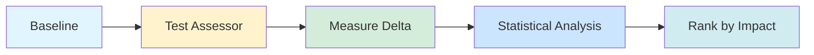

# Terminal-Bench Eval Harness Demos

**Multiple ways to explore AgentReady's empirical validation system**

Choose your preferred learning style:

---

<div style="display: grid; grid-template-columns: repeat(auto-fit, minmax(300px, 1fr)); gap: 2rem; margin: 3rem 0;">

  <!-- Terminal Demo Card -->
  <div style="background: linear-gradient(135deg, #667eea 0%, #764ba2 100%); border-radius: 12px; padding: 2rem; color: white; box-shadow: 0 4px 6px rgba(0,0,0,0.1);">
    <div style="font-size: 3rem; margin-bottom: 1rem;">🖥️</div>
    <h3 style="margin: 0 0 1rem 0; color: white;">Terminal Demo</h3>
    <p style="opacity: 0.95; margin-bottom: 1.5rem;">Watch a live CLI demonstration with interactive playback controls. See the exact commands and outputs.</p>
    <div style="display: flex; gap: 1rem;">
      <a href="/agentready/demos/terminal-demo" style="background: white; color: #667eea; padding: 0.5rem 1rem; border-radius: 6px; text-decoration: none; font-weight: bold;">Watch Demo</a>
      <span style="opacity: 0.7; padding: 0.5rem 0;">~3 min</span>
    </div>
  </div>

  <!-- Slide Presentation Card -->
  <div style="background: linear-gradient(135deg, #f093fb 0%, #f5576c 100%); border-radius: 12px; padding: 2rem; color: white; box-shadow: 0 4px 6px rgba(0,0,0,0.1);">
    <div style="font-size: 3rem; margin-bottom: 1rem;">📊</div>
    <h3 style="margin: 0 0 1rem 0; color: white;">Slide Presentation</h3>
    <p style="opacity: 0.95; margin-bottom: 1.5rem;">Conference-ready slides with architecture diagrams and visual workflow explanations.</p>
    <div style="display: flex; gap: 1rem;">
      <a href="/agentready/demos/slides" style="background: white; color: #f5576c; padding: 0.5rem 1rem; border-radius: 6px; text-decoration: none; font-weight: bold;">View Slides</a>
      <span style="opacity: 0.7; padding: 0.5rem 0;">~15 slides</span>
    </div>
  </div>

  <!-- Walkthrough Card -->
  <div style="background: linear-gradient(135deg, #4facfe 0%, #00f2fe 100%); border-radius: 12px; padding: 2rem; color: white; box-shadow: 0 4px 6px rgba(0,0,0,0.1);">
    <div style="font-size: 3rem; margin-bottom: 1rem;">📖</div>
    <h3 style="margin: 0 0 1rem 0; color: white;">Complete Walkthrough</h3>
    <p style="opacity: 0.95; margin-bottom: 1.5rem;">In-depth guide with Mermaid diagrams, interactive examples, and full command outputs.</p>
    <div style="display: flex; gap: 1rem;">
      <a href="/agentready/demos/walkthrough" style="background: white; color: #4facfe; padding: 0.5rem 1rem; border-radius: 6px; text-decoration: none; font-weight: bold;">Read Guide</a>
      <span style="opacity: 0.7; padding: 0.5rem 0;">~10 min read</span>
    </div>
  </div>

  <!-- Quick Reference Card -->
  <div style="background: linear-gradient(135deg, #fa709a 0%, #fee140 100%); border-radius: 12px; padding: 2rem; color: white; box-shadow: 0 4px 6px rgba(0,0,0,0.1);">
    <div style="font-size: 3rem; margin-bottom: 1rem;">⚡</div>
    <h3 style="margin: 0 0 1rem 0; color: white;">Quick Reference</h3>
    <p style="opacity: 0.95; margin-bottom: 1.5rem;">One-page cheat sheet with all commands, file structure, and statistical criteria.</p>
    <div style="display: flex; gap: 1rem;">
      <a href="/agentready/demos/quickref" style="background: white; color: #fa709a; padding: 0.5rem 1rem; border-radius: 6px; text-decoration: none; font-weight: bold;">Get Reference</a>
      <span style="opacity: 0.7; padding: 0.5rem 0;">1 page</span>
    </div>
  </div>

</div>

---

## What is the Eval Harness?

The Terminal-Bench eval harness **empirically measures** the impact of each AgentReady assessor on agentic development performance through systematic A/B testing.



### Key Features

- **Empirical Validation**: Measure actual impact on Terminal-Bench scores
- **Statistical Rigor**: P-values + Cohen's d for significance testing
- **Systematic A/B Testing**: Test each assessor independently
- **Interactive Dashboard**: GitHub Pages visualization with Chart.js
- **Comprehensive Reporting**: JSON, Markdown, and HTML outputs

---

## Current Demo Results

All demo commands executed on **AgentReady repository** (2025-12-07):

- **Baseline Score**: 58.35 ± 0.00
- **Assessors Tested**: 5 (all Tier 1)
- **Significant Improvements**: 0 (AgentReady already passes all!)
- **Tests Passing**: 56/56 ✅

**Why +0.00 delta?** AgentReady already has CLAUDE.md, README, type annotations, standard layout, and intentionally excludes lock files (library project). Testing on a non-compliant repository would show meaningful improvements!

---

## Quick Start

```bash
# Establish baseline
agentready eval-harness baseline . --iterations 3

# Test single assessor
agentready eval-harness test-assessor --assessor-id claude_md_file --iterations 3

# Aggregate results
agentready eval-harness summarize

# Generate dashboard
agentready eval-harness dashboard
```

---

## Related Pages

- **[Dashboard](/agentready/tbench)** - Interactive visualization with Chart.js
- **[Methodology](/agentready/tbench/methodology)** - Statistical methods explained
- **[User Guide](/agentready/user-guide)** - Complete AgentReady documentation

---

**Last Updated**: 2025-12-07
**Version**: 2.14.1
**Status**: Phase 1A-1F Complete ✅
